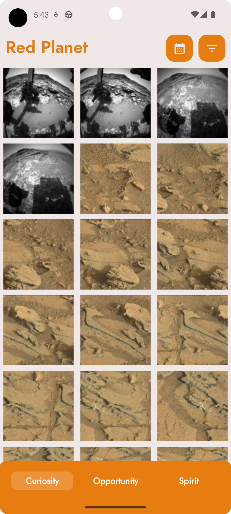
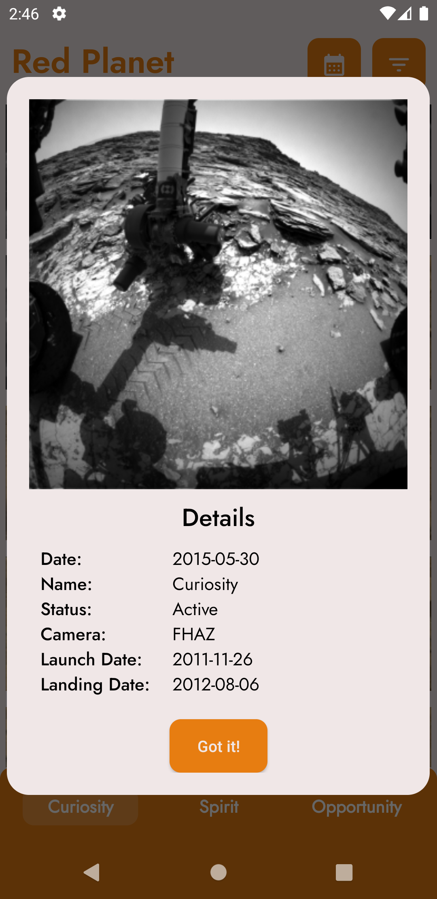
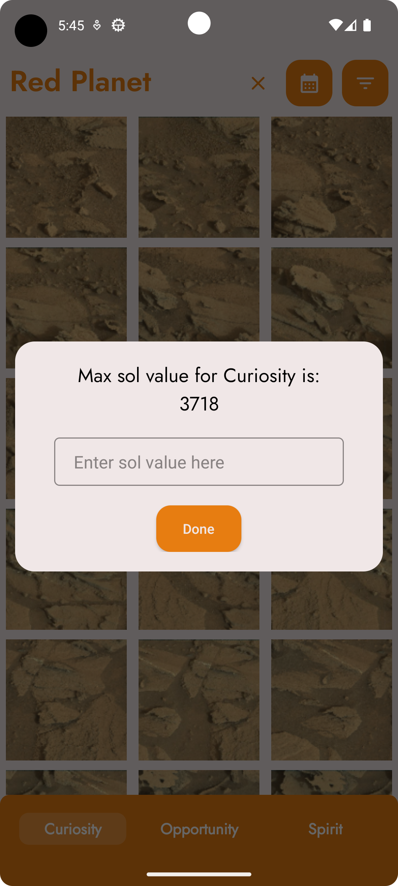
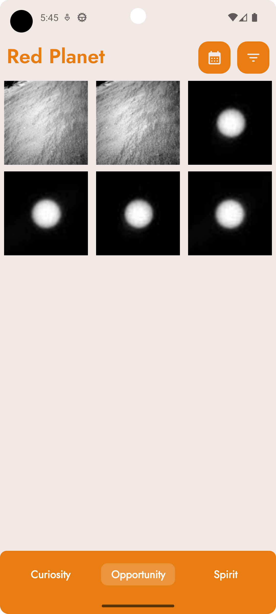
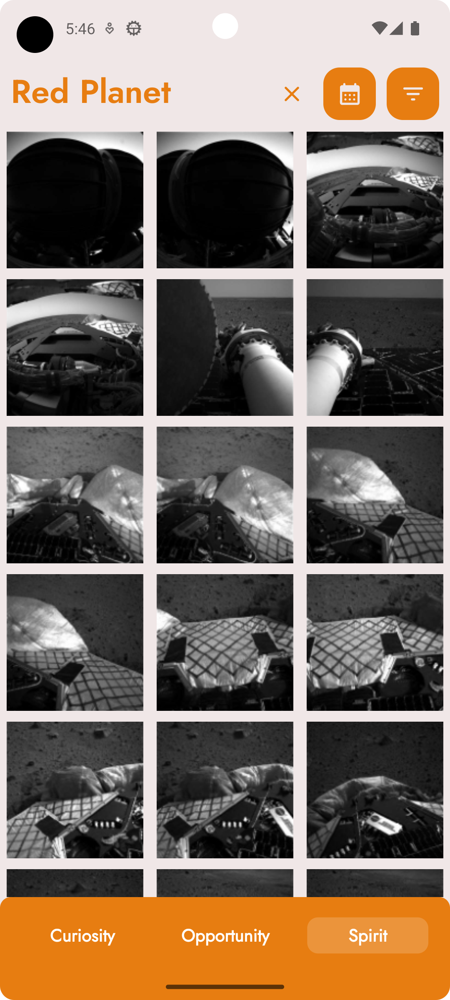
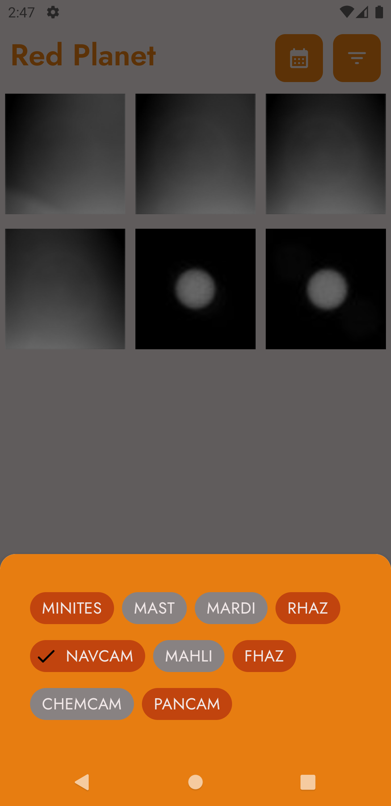

# Features

| Criteria                     | Status             |
| ---------------------------- | ------------------ |
| Pagination & infinite scroll | :heavy_check_mark: |
| 3 tab design                 | :heavy_check_mark: |
| Filter by camera             | :heavy_check_mark: |
| Details pop up               | :heavy_check_mark: |

# Must

| Criteria        | Status             |
| --------------- | ------------------ |
| Kotlin          | :heavy_check_mark: |
| OOP, SOLID      | :white_check_mark: |
| Retrofit/Okhttp | :heavy_check_mark: |

# Nice to Have

| Criteria                  | Status             | More Info                                |
| ------------------------- | ------------------ | ---------------------------------------- |
| Architecture Patterns     | :heavy_check_mark: | Clean Architecture, MVVM                 |
| Architecture Components   | :heavy_check_mark: | LiveData, ViewModel                      |
| Depenency Injection       | :heavy_check_mark: | Dagger - Hilt                            |
| Unit Test                 | :x:                |                    -                     |
| Additional Libraries Used | :heavy_check_mark: | Picasso, Dagger - Hilt, Facebook Shimmer |

# Screen Record
 or  to watch directly

# Screenshots
|:earth_americas:| :rocket:| :waning_crescent_moon:|
| ------------------------- | ------------------ | ---------------------------------------- |
|      |  | |
| |  | |

